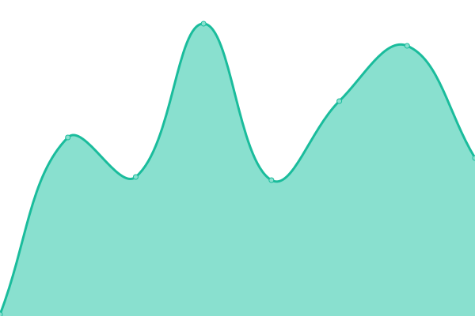
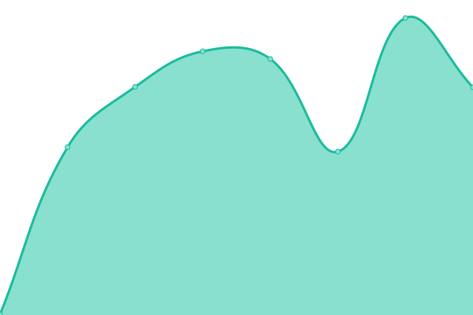
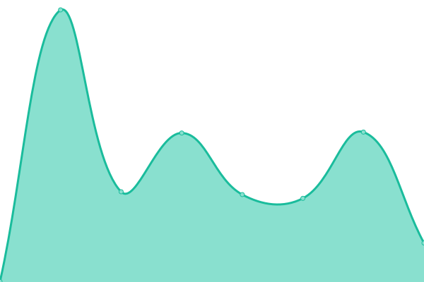
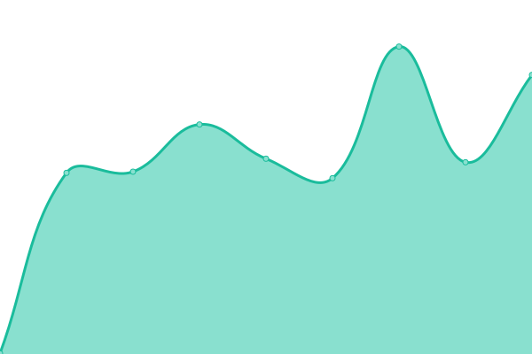

# [📈 Live Status](https://status.solar-control.tech): <!--live status--> **🟩 All systems operational**

This repository contains the open-source uptime monitor and status page for [Upptime](https://upptime.js.org), powered by [Upptime](https://github.com/upptime/upptime).

With [Upptime](https://upptime.js.org), you can get your own unlimited and free uptime monitor and status page, powered entirely by a GitHub repository. We use [Issues](https://github.com/upptime/upptime/issues) as incident reports, [Actions](https://github.com/markFieldman/solar-control-status/actions) as uptime monitors, and [Pages](https://status.solar-control.tech) for the status page.

<!--start: status pages-->
<!-- This summary is generated by Upptime (https://github.com/upptime/upptime) -->
<!-- Do not edit this manually, your changes will be overwritten -->
<!-- prettier-ignore -->
| URL | Status | History | Response Time | Uptime |
| --- | ------ | ------- | ------------- | ------ |
|  [Solar Control Site](https://www.solar-control.tech) | 🟩 Up | [solar-control-site.yml](https://github.com/markFieldman/solar-control-status/commits/HEAD/history/solar-control-site.yml) | 

 227ms
     
 | 

<a href="https://status.solar-control.tech/history/solar-control-site">100.00%</a>
    

|  [Bot Core](https://botapi.solar-control.tech) | 🟩 Up | [bot-core.yml](https://github.com/markFieldman/solar-control-status/commits/HEAD/history/bot-core.yml) | 

 507ms
     
 | 

<a href="https://status.solar-control.tech/history/bot-core">100.00%</a>
    

|  Solar Control Viber Bot | 🟩 Up | [solar-control-viber-bot.yml](https://github.com/markFieldman/solar-control-status/commits/HEAD/history/solar-control-viber-bot.yml) | 

 203ms
     
 | 

<a href="https://status.solar-control.tech/history/solar-control-viber-bot">100.00%</a>
    

|  Solar Control Cloud | 🟩 Up | [solar-control-cloud.yml](https://github.com/markFieldman/solar-control-status/commits/HEAD/history/solar-control-cloud.yml) | 

 470ms
     
 | 

<a href="https://status.solar-control.tech/history/solar-control-cloud">100.00%</a>
    

<!--end: status pages-->

[**Visit our status website →**](https://status.solar-control.tech)

## 📄 License

- Powered by: [Upptime](https://github.com/upptime/upptime)
- Code: [MIT](./LICENSE) © [Upptime](https://upptime.js.org)
- Data in the `./history` directory: [Open Database License](https://opendatacommons.org/licenses/odbl/1-0/)
